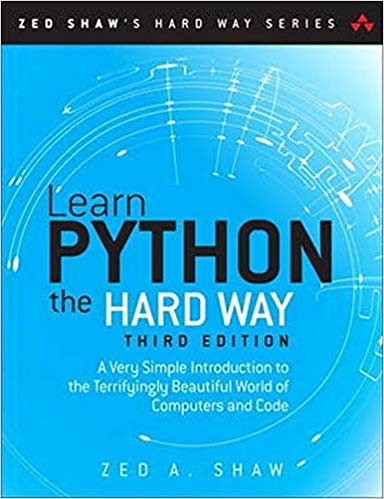
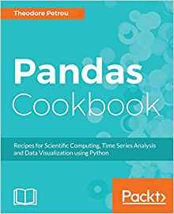
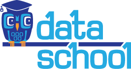

When people I work with find out that I use Python to work with data and solve problems, they usually ask one of two questions: "What kind of stuff can you do with it?" and "How did you learn it?" This is an attempt at putting my answers in one place so I can easily point people here. This page is a collection of tutorials and reference material. But don't forget that it's best to learn by doing. Learn some of the basics from these resources, start trying to solve some problems, and then learn what you need as you go. Google and Stack Overflow are your friends.

# What kind of stuff can you do with it?
This is definitely the right question to ask first. It's way easier to learn Python if you have a problem you want to solve in mind. Learning to code is not particularly hard, but you *will* run into quite a few challenging road blocks. If you decide to start learning python without a clear goal, these road blocks might be discouraging enough to make you decide your time is better spent elsewhere. But if you come into the process with the concrete knowledge of how learning these skills will help you, you will have the motivation to push through.

With that in mind, these are some of my favorite places to go for inspiration and to learn some of what can be done. If you are new to Python, take a look at some of these resources. Don't be discouraged if you don't understand how any of it works or if you are confused by the code. You will learn. 

### [Agile Scientific's Blog "X-Lines of Python" Series](https://agilescientific.com/blog/category/X+Lines)

In the [X-Lines of Python](https://agilescientific.com/blog/category/X+Lines) series, the people at Agile share some common geoscience workflows in just a few lines of code. Here are some of my favorites:

* [Synthetic Wedge Model](https://agilescientific.com/blog/2016/9/15/x-lines-of-python-synthetic-wedge-model)
* [Machine Learning](https://agilescientific.com/blog/2017/1/4/x-lines-of-python-machine-learning)
* [Read and Write a Shapefile](https://agilescientific.com/blog/2017/8/10/x-lines-of-python-read-and-write-a-shapefile)
* [Load well data from LAS](https://agilescientific.com/blog/2017/8/10/x-lines-of-python-read-and-write-a-shapefile)

### [Practical Business Python](https://pbpython.com/)
[Practical Business Python](https://pbpython.com/) is a blog that is "taking care of business one python script at a time." The site is a wealth of practical information about using Python to solve everyday problems. I recommend reading Common Excel Tasks Demonstrated in Pandas [Part 1](https://pbpython.com/excel-pandas-comp.html) and [Part 2](https://pbpython.com/excel-pandas-comp-2.html) and [Pandas Pivot Table Explained](https://pbpython.com/pandas-pivot-table-explained.html). Pandas is Python's library for analyzing and manipulating tabular data. If you become familiar with it, you may never want to use Excel again.

### [SEG Leading Edge Geophysics Tutorials](https://wiki.seg.org/wiki/Geophysical_tutorials)

The [SEG Geophysical Tutorials Series](https://wiki.seg.org/wiki/Geophysical_tutorials) ran in *The Leading Edge* 2014 through 2018. Each tutorial is a brief exploration of a geophysical topic typically with accompanying Python code and open access data. Start with this [user guide](https://wiki.seg.org/wiki/A_user_guide_to_the_geophysical_tutorials) and then explore some of the others.

# How do you learn it?
There are so many great tutorials and resources out there for learning Python. The best ones for you will depend on your learning style. I'll recommend some of the resources I have used and continue to refer to. They may not be the *best*, but they are working well for me. I tend to like learning from books, but there are many online video courses, interactive tutorials, and in person trainings that are also very good. 

## Python Basics
First, you should spend some time learning some base Python. You need to understand the basic syntax, data types, and flow control in order to be productive. Once you have a handle on the basics, you should start to learn some of the data analysis libraries. These are packages outside of the standard Python library that provide additional functionality. 

### [Learn Python the Hard Way by Zed Shaw](https://www.amazon.com/dp/0321884914)

If you are brand new to coding, start [here](https://www.amazon.com/dp/0321884914). It turns out the hard way is actually the easy way. The approach from the book is "*It'll be hard at first. But soon, you'll just get it-and that will feel great!*" The book used to be freely available online, but now costs around $30. It is totally worth it. Reading through this book and doing the exercises will ensure you have a good handle on base Python before you start diving into more complicated tasks. I particularly like it because it assumes no prior knowledge of computer programming and is written in a non-overwhelming, down-to-earth style. Buying the book gets you access to video lectures too.

### [Whirlwind Tour of Python](https://jakevdp.github.io/WhirlwindTourOfPython/)

If you have some coding experience in another language and you want to quickly get up to speed with Python specifics, check out [this book](https://jakevdp.github.io/WhirlwindTourOfPython/)
. It is an overview of the python language with a focus on functionality that is particularly useful for data analysis. As a bonus, this book is freely available online both as an ebook, a pdf and as Jupyter notebooks that you can download and try out the code yourself.

### [Python for Everybody](https://www.coursera.org/specializations/python)
This course is available as a [Coursera series](https://www.coursera.org/specializations/python) taught by Professor Charles Severance from University of Michigan. It's an approachable introduction to Python and some related concepts like databases and basic web development. The lessons and textbook are also available for free on [the website](https://www.py4e.com/).

## Learning the Data Science Stack
The real power of Python lies in the rich ecosystem of third-party, open-source packages and libraries. These are collections of code that perform almost any task you can think of. They are what make python so flexible. Install and import them, and you have access to the work of open source developers all over the world.

### [Python Data Science Handbook](https://jakevdp.github.io/PythonDataScienceHandbook/)

This [book](https://jakevdp.github.io/PythonDataScienceHandbook/) is a classic in the python data science world. It is a few years old now but it is a great introduction and reference to the essential tools and libraries of the Python data stack. It teaches numpy for arrays and numerical calculations, pandas for tabular data analysis, matplotlib for plots and graphs, and scikit-learn for machine learning. Similar to the Whirlwind Tour of Python, Vanderplas wrote the entire book in Jupyter notebooks that you can download for free and interact with the code.

### [Pandas Cookbook](https://www.amazon.com/Pandas-Cookbook-Scientific-Computing-Visualization/dp/1784393878) and [Dunder Data](https://www.dunderdata.com/)

In my experience, pandas has been one of the most useful, general purpose python tools that I have learned. Like I said before, if you get familiar with it, you may never want to use Excel again. The Python Data Science Handbook has a great introduction, but I think it is worth spending some time getting more familiar with what pandas can do. I really liked the Pandas Cookbook by Ted Petrou. It is filled with examples and explanations of how to do common tasks using pandas. Ted now says the book is out of date, poor quality, and no one should buy it. So check out his updated Data Analysis Course on his website, [dunderdata.com](https://www.dunderdata.com/). It includes an updated pdf book and code examples and exercises in Jupyter notebooks.

### [Data School](https://www.dataschool.io/start/)

Kevin Markham from [Data School](https://www.dataschool.io/start/) has a great collection of blog posts, courses and YouTube videos covering Python, pandas, machine learning, and other data science topics.

## Spatial Data Analysis
As a geologist, almost all the data I work with has some spatial element to it. There are a lot of good python tools for working with spatial data. In particular, [geopandas](http://geopandas.org/) for vector data (eg shapefiles), [rasterio](https://rasterio.readthedocs.io/en/latest/) for raster data, and [rasterstats](https://pythonhosted.org/rasterstats/) for zonal statistics are all worth learning. 

### [Earth Data Science](https://www.earthdatascience.org/)

[This site](../assets/images/earth-lab-logo.png) hosts free tutorials, workshops and courses for learning how to work with spatial data in both Python and R developed by Earth Lab at University of Colorado, Boulder. There is also great material on the site covering important topics like the importance of reproducible, open science, git and GitHub for version control and collaboration, and unit testing.

