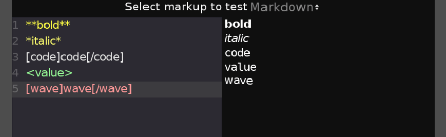

Sorry for the long silence on Rakugo. 
A lot has happened in real life.
But also a lot has happened in Rakugo development.
Let me tell you what happened in development of Rakugo 3.3.

# Let's summarize what has happened:

## Progress in Rakugo 3.3
I abandon use of Trello as Rakugo Roadmap.
It is too much work to keep track of all the tasks and issues 
in two places Trello and Github.
Which made it difficult to find out what is going on
as I often forget to add proper issues on github.

So I decided to use Github Issues and Projects features instead.

[Now you can check the progress of Rakugo 3.3 in Github: here](https://github.com/rakugoteam/Rakugo/projects/1)

I hope this change will make easier to contribute to Rakugo development.

## Planned Release Date

I want to release Rakugo 3.3 in this month.

## Plugins, Plugins, Plugins!!!
I started to split Rakugo to separated plugins.
There are 2 reasons for this:
- It will allow to easier update and development of Rakugo
- Some of parts of Rakugo should be usable outside of Rakugo 

Separated plugins are:
- [Emojis](https://github.com/rakugoteam/Emojis-For-Godot)
- [Material Icons](Godot-Material-Icons)
- [***Adventure***: Point 'n' Click (nodes and features) (WIP)](https://github.com/rakugoteam/Adventure)
- Markdown(WIP)
- RPG(To Do)

## Fixes, Fixes, Fixes!!!

### Emojis

Now **Emojis Finder** are loading was speed up,
by use of script to generate emojis grid scene once instead
of crating it from *emoji.json* each time when **Emojis Finder** was shown.

### Rakugo

#### Fixed

- Rollback / forward, before it was broken and was working only for -1 and 1+ step.
- Some smaller fixes in the code.

#### Fixes In Progress

I'm not yet sure how I will fix this, but I will try:
- fix `jump()` function behaviour
- fix `cond()` function behaviour on rollback and forward
- fix quitting from the game
- fix bug that made window sometimes chaining size on start

## New Features

### Rakugo

#### RakugoTextEdit
This is a new tool in upcoming Rakugo 3.3.
It will allow to edit and preview text for dialogues lines and for RakugoTextLabels used in game UI.

I already have some ideas for this feature:
- I want to try add autocomplete for some of the words
- autocomplete for RakugoVars / Characters
- autocomplete for effects menu
- Add select button for each markup
- Integrate with Godot

### Adventure

[***Adventure***](https://github.com/rakugoteam/Adventure) is totally Rakugo Point & Click module rewritten.
- now it's developed as separated plugin so it can be used with Rakugo or other dialogs-system
- it now use ideas and naming convections from old dead WinterMute Engine.
- now it has new node: **Region2D** new version of old **AreaButton2D**
- no need for **MouseBody2D** anymore

#### New Nodes To Do in Adventure 0.2
- **Floor2D** - for crating walkable areas
- **ZScaler2D** - for scaling character according to in position on scene
- Maybe more if I have time

