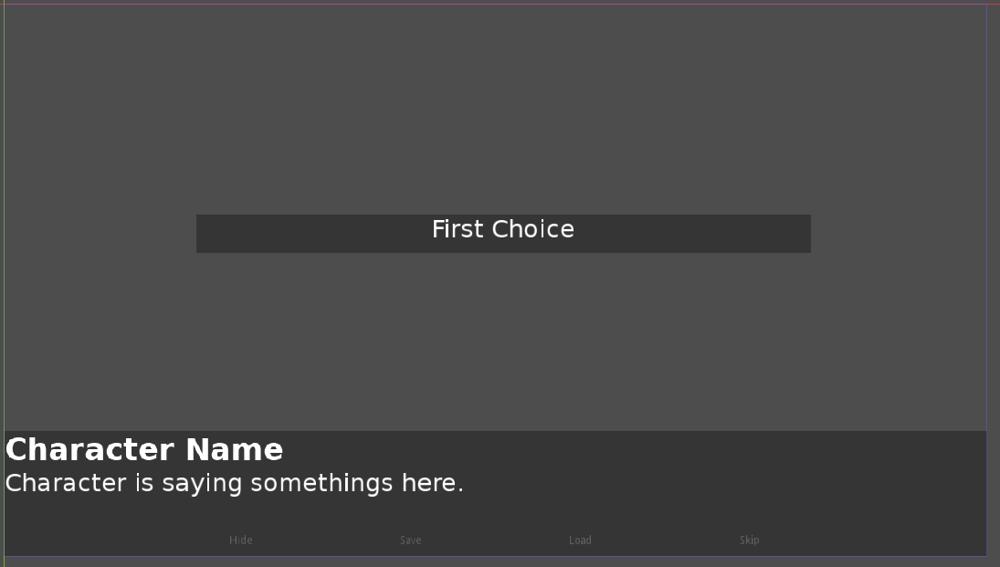

Hi everyone, here is the 4th devlog of **Rakugo 3.3**.

## Visual Novel Kit and new Rakugo 3.3

*Title Screen of NVKit*


*In Game/Dialogue UI of NVKit*


I'm working on **[VisualNovelKit]** for **[Rakugo]**.
It's done in most way as I was able to bring back ui from old Rakugo as this new one.
It been changed to use this plugins instead of old Rakugo build-in:

- [AdvancedText]
- [Emojis-for-Godot]
- [Godot-Material-Icons]

It needs 2 more addons to be complete:

- [QuickSceneIDs] (new standalone version of SceneLinks) (WIP)
- TagManager (new standalone, more advanced version of ShowableManger) (ToDo)

We consider adding to it also **[EditLinePlus]**, to add more features to `ask()`.

### How new Rakugo 3.3 works with Visual Novel Kit

The most big difference is that we separated handling ui from Rakugo's code.
In new Rakugo there will be no more so called `parameters` they will moved to kit code.
That means for example:
```gdscript
# Old
Rakugo.say(null, "Hello World!", {"time_typing": 0.5})

# New
Kit.set_parameter({"time_typing": 0.5})
Rakugo.say(null, "Hello World!")
```
This will also easier for us and others to make other kits.

### Easy Updating Kits thanks to gd-plug / GDPM

**[gd-plug]** is a plugin for Godot that allows you to easily update your project.
It is already used by **Rakugo 3.3**, but now it needs to be run from command line
 and edits to *plug.gd* file if new addon is added to project.
So I decided to make it made gui frontend for it.
It probably will be a standalone Godot app called *GDPM* (Godot Package Manager).
In which you choose project to update and then just press `Update` button.

### Customization of Visual Novel Kit UI

To make it easy and that the same time hard to break as users, we decided to distribute kits as project templates.
Every kit template project will be had this structure:
```
|res://
|- addons
|  |- kit
|  |- other addons
|- ui
|- game 
```

So `kit` dir will have:

- all ui scenes and scripts
- gd-plug config file

`ui` dir will have ui scenes that will be a so called `inherited` scenes,
that means you can modify their nodes and add new ones, but you can`t delete them.

`game` dir is where you should put your game scenes and scripts.
You don't have to use it. It will have some example scripts and scenes how to use kit.
Our recommend approach to Godot project is that every scene, assets and script should be in one dir name the same as scene name.

## Other Changes in Rakugo 3.3

I'm mostly cleaning and removing old stuff from Rakugo that is not needed anymore, as it's mostly turned into separated addons.
[@theLudovyc] is working hard on Rakugo 3.3 mostly rewriting code under the hood. As I already mentioned above he makes Rakugo more standalone, this is way Rakugo is no longer handling ui.
But also he changed the way how `menu()` works, old menu could be very confusing and hard to understand, so we decided to rewrite it.

New `menu()` will looks like this:
```gdscript
var choices := {
  "talk":"Talk to Emily.",
  "arcade":"Go with Emily to Arcade.",
  "leave":"Leave Emily."
}

if Rakugo.get_var("emily.relationship") < 30:
  choices.remove("arcade")

var choice := menu(choices)
match:
  "talk": # "Talk to Emily"
    ...
  "arcade": # "Go with Emily to Arcade"
    ...
  "leave": # "Leave Emily"
    ...
```

As you see we simplify menu by removing parameters per choice and switching to use dictionary for choices as its make it easier to add/remove choices at runtime. But also make as sure that this will work with Godot build-in translations system in future, when we connect Rakugo to it.


[VisualNovelKit]: https://github.com/rakugoteam/VisualNovelKit 
[Rakugo]: https://github.com/rakugoteam/Rakugo
[AdvancedText]: https://github.com/rakugoteam/AdvancedText
[Emojis-for-Godot]: https://github.com/rakugoteam/Emojis-for-Godot
[Godot-Material-Icons]: https://github.com/rakugoteam/Godot-Material-Icons
[QuickSceneIDs]: https://github.com/rakugoteam/QuickSceneIDs
[EditLinePlus]: https://github.com/MrEliptik/line_edit_plus
[gd-plug]: https://github.com/imjp94/gd-plug
[@theLudovyc]: https://github.com/theludovyc